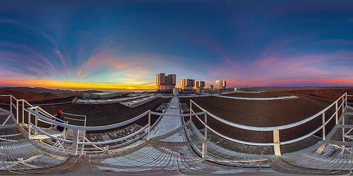
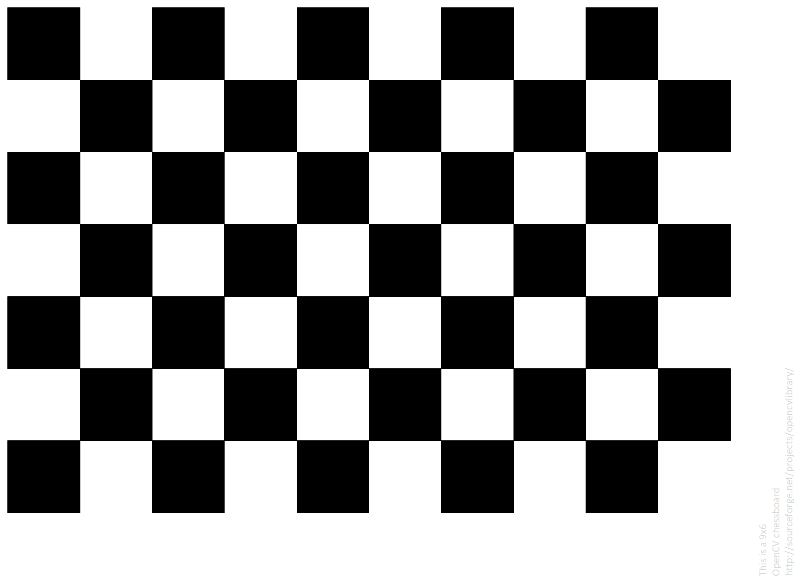
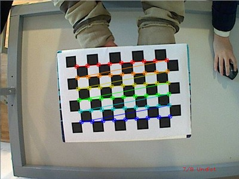

# Photosphere
PANORAMA IMAGE: (BTW IN THIS CASE IT MUST BE A 360 PANORAMIC IMAGE)
Panoramic photography is a technique of photography, using specialized equipment or software, that captures images with horizontally elongated fields of view. It is sometimes known as wide format photography. The term has also been applied to a photograph that is cropped to a relatively wide aspect ratio, like the familiar letterbox format in wide-screen video.

PHOTOSPHERE:
A 360 photosphere is a 360-degree image that captures the entire surrounding environment in a full spherical view, allowing users to look around as if they were physically present. It's essentially a panoramic image that extends beyond the traditional horizontal or vertical view, providing a complete, immersive perspective

Additionally this code was meant to be used with combination with hugin to stich the panorama together used with window's enviroment.

https://sourceforge.net/projects/hugin/files/latest/download

(additionally if you are using mac, you need to somehow bypass the privacy security and further adjustments must be made to use the code as windows and mac sees pixels differently (so the diemsions of the code MUST be changed))

BASIC PROCESS;
1. Turn a fisheye lens (180) in a circle with plenty overlap covering 60-70%
2. Turn Image into a 360 photosphere (keeping the fisheye distorsion)
3. Transform 360 panorama image into a 360 photosphere

Method #1 of creating a photosphere (unfinished)
1. Using OpenCv to undistort the fisheye lens

 (A matrix is required in OpenCV for lens distortion correction because it represents the intrinsic parameters of the camera, including focal length and principal point, which are crucial for accurately projecting 3D points onto the 2D image plane.)

 ---------------------------------SEPERATION BAR-------------------------------------

camera_matrix = np.array([
    [541.056195, 0.0, 1013.64961],
    [0.0, 543.349657, 537.574495],
    [0.0, 0.0, 1.0]
])

dist_coeffs = np.array([
    -0.275578416, 0.0620585976, -0.000165639731, -0.00361457908, -0.00536155023
])

#this is the best resulting matrix to undistort the images but you are welcome to #Try addition refer to callibration.py to undistort and create your own matrix

#How to Properly Callibrate:
#(1.) 
#-using this image save it into your computer and use calibration.py to use the live webcam to essentially scan the chessboard 

#IMPORTANT: SCAN THE CHESSBOARD FROM EVERY POSSIBLE ANGLE, HEIGHT, AND DISTANCE IF POSSIBLE IT ALSO HELPS IF DOING THIS IN A DARK ENVIROMENT

# (THIS IS IF YOU KNOW IF IT WORKS WHEN YOU SEE THESE TIDE POINTS PRESS C WHEN YOU SEE THIS)

#(2)(press keybind c to capture and q to combine ALSO PLS MAKE SURE YOU ARE ON WEBCAM TAB WHEN PRESSING C OR Q) AND RECORD THE MATRIX FOUND BELOW THE TERMINAL

---------------------------------SEPERATION BAR-------------------------------------

2. Using this matrix to undistort the images USE openCV to stich set images and this will form a simple pananorama. Use panaroama.py
    -FURTHER THE MATRIX CAN BE REPLACED AS NEEDED

3. Use set images to create a photosphere using (unfinish I wish you the best of luck on this one also I recomend adding a 180 distorsion filter to the finish panorama)

(4. OPTIONAL: You could potentially combine hugin and combine it using the finish panorama to create photosphere as this method provides the best result of panorama)

Method #2 (Finished but buggy)
https://chatgpt.com/share/681bb07c-73b4-800b-8b43-2738d99366c3 (THIS IS THE CHAT I USE ASK IF YOU ANY QUESTIONS)

1. Dowload Hugin (MAKE SURE IT WORKS: RECOMENDED ON WINDOWS BUT CAN WORK ON MAC)
2. USE OPEN.PY and when using this program (IT IS RECOMENDED THAT YOU TAKE AROUND 4-6 IMAGES AT MOST FOR THE BEST RESULTING PANRORAMA IN 45 DEGREE INCREMENTS)
3. TO SAVE A IMAGE press c for capture and q for compiling (MAKE SURE YOU ARE ON THE TAB OF THE WEBCAM)
4. (VERY IMPORTANT) when hugin is open set lens type to fisheye lens and set hfov to 180 degrees
(OPTIONAL I NEVER TRIED THIS BUT YOU CAN TRY TO MANUALLY PULL THE LENS INFORMATION ON TOP LEFT CORNER TO HAVE THE SPECIFIC SPEFICATIONS OF THE FISHEYE LENS)
5. FINAL STEP ON THE LEFT SIDE OF THE SCREEN on the option panosphere select (inside)

Now you must be wondering why there duplicates or parts missing.
-if there are there duplicates that means there is to much information such as to many photos
-if there is are gaps then there isnt enough information
-this is why taking 4 images total recomended (technially 8 images since the images are taken in pairs)
-FINALLY THIS OPTIONAL BUT MAY IMPROVE PHOTOSPHERE (ALSO REMEMBER EVERYTHING IS DEPENDENT ON YOUR A PANORAMA IMAGE) YOU CAN DESELECT IMAGES IN DISPLAYED TO POTENTIALLY IMPROVED PHOTOSPHERE
